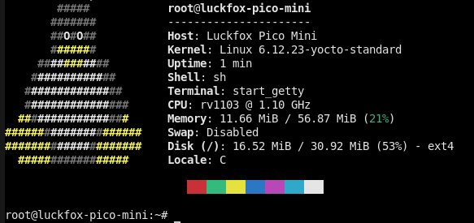
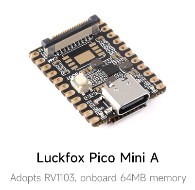

# meta-rv110x

Yocto BSP layer for Rockchip boards based on RV1103/RV1106.

## 📋 Description

The purpose of this layer is to provide OpenEmbedded BSP support for
Rockchip boards based on RV1103/RV1106 using ported rockchip-linux sources.

## 🛹 Supported boards
| Name                | Link                                          | View     |
:--------------------:|:---------------------------------------------:|:-----------:
| Luckfox Pico Mini A | <https://www.luckfox.com/Luckfox-Pico-Mini-A> | |

## 🔧 Development status
- [x] 🚀 Initial support in u-boot
- [x] ✈️ Initial support in linux kernel
- [x] 🌐 Ethernet with static MAC
- [ ] 📼 Boot from NAND
- [ ] 🔌 USB host support
- [ ] 📷 Camera serial interface
- [ ] 📥 RAUC support for SD card
- [ ] 📥 RAUC support for NAND
- [ ] 📺 Support for some display controllers

## 🔗 Dependencies

This layer depends on:

* URI: git://git.openembedded.org/openembedded-core
  * branch: walnascar
  * revision: HEAD

* URI: git://git.yoctoproject.org/meta-rockchip
  * branch: walnascar
  * revision: HEAD

## 🙏 Contributing

If you have a desire to help with the development of this layer, or perhaps you would like to help develop patches with soc support for u-boot or linux kernel, then open discussions or pull requests, I would be very glad of any help.

## 🦾 Maintainers

* Raman Rakavets `<radikot88@gmail.com>`